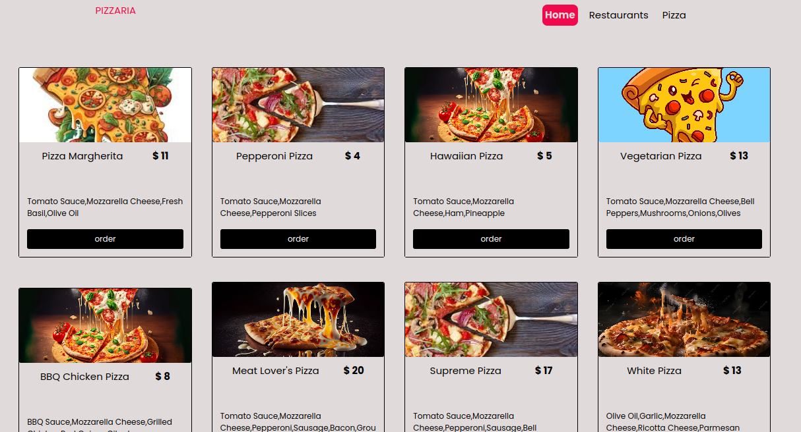
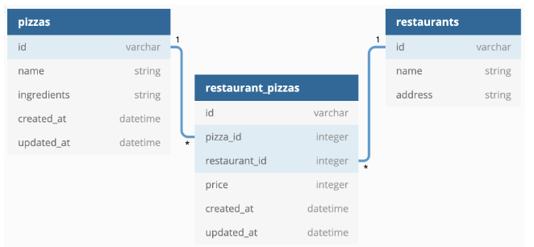

# THE PIZZERIA

#### Description

this projects sets up routes and resources for managing restaurants, pizzas, and restaurant pizzas through a Flask RESTful API. It includes endpoints for retrieving, creating, and deleting restaurant and pizza records and handling the relationships between them.

# SET UP & CONFIGURATION

### 1. Create virtual environment and activate it

- install virtualenv `pip install virtualenv`
- give virtualenv a name `virtualenv name`
- activate the virtualenv `source name/bin/activate`

### 2. Install required packages packages

- `alembic==1.12.0`
- `Faker==18.13.0`
- `faker_food==0.2.0`
- `Flask==2.3.3`
- `Flask-Cors==4.0.0`
- `Flask-Migrate==4.0.5`
- `Flask-RESTful==0.3.10`
- `Flask-SQLAlchemy==3.1.1`
- `gunicorn==21.2.0`
- `Jinja2==3.1.2`
- `Mako==1.2.4`
- `pytest==7.4.2`
- `SQLAlchemy==2.0.21`
- `SQLAlchemy-serializer==1.4.1`
- `Werkzeug==2.3.7`

### Flask Code Challenge Deliverables

This is a project creating a FLASK API for a Pizza Restaurant domain.

Running the Flask server and using Postman to make requests
Models. You need to create the following relationships:

- A Restaurant has many Pizzas through RestaurantPizza
- A Pizza has many Restaurants through RestaurantPizza
- A RestaurantPizza belongs to a Restaurant and belongs to a Pizza

### Validations

Add validations to the RestaurantPizza model:

- Must have a price between 1 and 30

Add validations to Restaurant Model:

- must have a name less than 50 words in length
- must have a unique name
